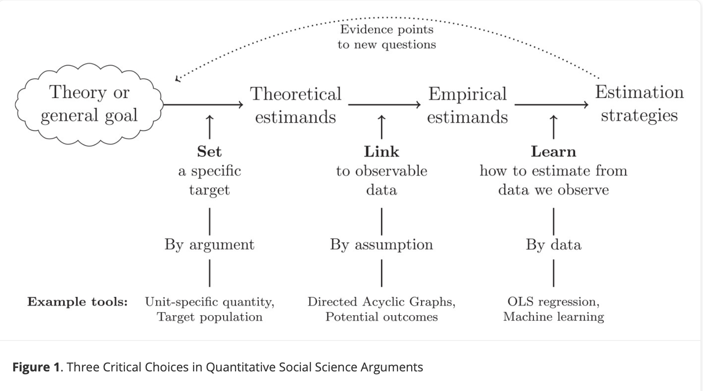

```{r echo = F}
library(cmdstanr)
library(tidyverse)
```

## Course goals

::: {.incremental}

1. Become comfortable with Bayesian inference 

2. Develop a thoughtful social science workflow

3. Become skilled at connecting theory to explicit causal and statistical models

4. Understand how to conduct simulations for each stage of the statistical workflow

5. Understand how to estimate and interpret Bayesian regression models

6. Produce high-quality data visuals to communicate statistical findings

:::

# Getting Started

## Software

::: {.incremental}

1. Install /  update R if needed <https://cran.r-project.org/>
2. Install / update RStudio if needed <https://rstudio.com/>
4. Install cmdstanR <https://mc-stan.org/cmdstanr/articles/cmdstanr.html>
5. Install rethinking package <https://github.com/rmcelreath/rethinking/tree/Experimental>

:::

## Git

- Install Git <https://git-scm.com/>

1. Open your terminal [Mac, Linux] or Git Bash [Windows]

```
cd docs [Arbitrary! choose any location you like]
git clone https://github.com/f-edwards/advanced_stats_bayes.git
```

2. Then, to update with the latest slides / data / etc

```
cd docs/advanced_stats
git fetch
```

## Install and confirm cmdstanr

```
install.packages("cmdstanr", repos = c('https://stan-dev.r-universe.dev', getOption("repos")))

library(cmdstanr)

# Check C++ toolchain
check_cmdstan_toolchain()

# install guide here if failed: https://mc-stan.org/docs/cmdstan-guide/installation.html#cpp-toolchain

install_cmdstan(cores = 2)
```

## Confirm cmdstanr works

```{r}
file<-file.path(cmdstan_path(), "examples", "bernoulli", "bernoulli.stan")
mod <- cmdstan_model(file)
print(mod)
```

## Install and confirm brms

```
install.packages("brms")
library(brms)
```

## Software overview

::: {.incremental}

1. R is a statistical programming language
2. RStudio is our interactive development environment (IDE) to write code in R
3. Stan is a C++ package that efficiently fits Bayesian models
4. `cmdstanr` is an interface that connects R to Stan
5. `brms` is an interface that uses familiar R model syntax to specify models in Stan
6. Quarto is a markdown language that allows us to weave together plaintext, code, and output. It runs in RStudio

:::

## If you feel lost

::: {.incremental}

- It's ok, this course is hard!
- This course closely follows McElreath's *Statistical Rethinking, 2nd edition*
- His lectures and slides for the course are available for further review <https://github.com/rmcelreath/stat_rethinking_2026>

::: 

# All models are wrong...

## So why do statistics?

::: {.incremental}

- Learn about something we can't see (parameters) from something we can (data) \pause
- Models are very powerful, but inherently simplifying \pause
- Statistical models $\neq$ scientific models
- Models should be in service to theory and science

:::

## Some are useful

::: {.incremental}

- We create mathematical abstractions of reality in our models
  - $P(Recidivism) = f(age, gender)$
- They are always incomplete 

:::

## Workflow

::: {.incremental}

We will prioritize developing a principled *workflow* for data analysis

1. Describe your estimand(s)
2. Develop a generative model for the process
3. Develop a statistical model 
4. Prepare your data
5. Compute an estimate

:::

## Theory and estimands



## Exercise


## Generative models

::: {.incremental}

- Bayesian models are *generative*
- Simulation is a key part of our workflow
- Before looking at the data: can we simulate data that look reasonable?
- After we estimate the model, can we simulate data that look similar to the observed?

:::

## Statistical models

Statistical models are tools to extract information on a target estimand from data.

## Why Bayesian statistical models?

::: {.incremental}

- Data is messy
- Bayesian approaches provide principled approaches for measurement error, regularization, multilevel modeling, handling missing data, and inference
- Downside is compute time
- Start simple and iterate with increasing complexity

:::

## Core principles

::: {.incremental}

**Models serve theories, not the other way around**

- Theory before models
- Formally specify causal theory as assumptions
- Clearly connect theory and causal model to target estimand

:::

# Probability revisited

## Frequentist probability

Probability is the relative frequency of the outcome of an experiment when the experiment is repeated a large number of times. 

## Bayesian probability

Probability is a numerical expression of subjective uncertainty ('beliefs', 'knowledge') about an event. 

## Why Bayesian?

::: {.incremental}

- A more intuitive approach to interpreting statistical parameters (p values, confidence intervals)
- Computational costs have decreased rapidly 
- Priors are a useful way to incorporate what we already know 
- Reduces overfitting through regularization
- Applications in scientific inference, prediction, machine learning

:::

# Drawing marbles from a bag

## The experiment 


Let's assume a bag with four marbles, which can be either red or green.

. . .

We design an experiment in which we draw three marbles from the bag. 

. . . 

Possible outcomes include:

RRRR, RRRG, RRGG, RGGG, GGGG

## Building a generative model

What could this process look like?

. . . 

To begin, let's assume that each marble has an equal chance of being Red or Green. 

. . . 

$$P(Red) = P{(Green) \sim Bernoulli(0.5)}$$

. . . 

And let's define our estimand as $\theta$, where $\theta$ is the total number of red marbles in the bag

## A prior?

We can directly simulate what the data could look like if there is an equal probability that each marble is red or green

```{r}
# assuming 1 = Red, 0 = Green
marbles <- vector(length = 4)
# take 4 draws from a Bernoulli(0.5)
for(i in 1:4){
  marbles[i] <- rbinom(1, 1, 0.5)
}
marbles
```

## One simulation does not a distribution make

```{r}
# intialize empty data frame
marbles_prior <- data.frame(red = rep(NA, 1000), green = rep(NA, 1000))
# iterate experiment 1000 times
for(j in 1:1000){
  marbles <- vector(length = 4)
  for(i in 1:4){
    marbles[i] <- rbinom(1, 1, 0.5)
  }
  # output, 1=red, 0 = green, sum(marbles) = n_red, 4-sum(marbles) - n_green
  marbles_prior$red[j] <- sum(marbles)
  marbles_prior$green[j] <- 4-sum(marbles)
}
```

## Prior simulation results

```{r}
hist(marbles_prior$red)
```

## On a probability scale

```{r}
hist(marbles_prior$red, freq = F)
```

## An alternative

We can also solve for these probabilities exactly. 

. . . 

Remember that the sum of Bernoulli random variables is a binomial random variable.

. . . 

We can use the binomial probability mass function directly to get exact values.

```{r}
dbinom(0:4, 4, 0.5)
```

## Let's make this into a table

```{r}
prior_tab <- marbles_prior |> 
  group_by(red) |> 
  summarize(n = n()) |> 
  mutate(prior_sim = n / sum(n),
         prior_exact = dbinom(0:4, 4, 0.5))
prior_tab
```

## Let's draw a marble!

```{r}
#| echo: false
bag <- c("red", "red", "red", "green")
```

I'd now like to draw one marble from the bag:

. . .

```{r}
#| echo: false
bag[1]
```

. . .

How should we change our belief about the likely distribution of marbles in the bag?

```{r}
#| echo: false
prior_tab
```


## Bayes' rule

The classic approach

$$P(B|A) = \frac{P(A|B) P(B)} {P(A)}$$

## Bayes' rule

How we'll actually think about it most of the time

$$P(\textsf{parameter}|\textsf{data}) = \frac{P(\textsf{data}|\textsf{parameter}) P(\textsf{parameter})}{P(\textsf{data})}$$

## Normalizing can be tricky

$$P(\textsf{parameter}|\textsf{data}) \propto P(\textsf{data}|\textsf{parameter}) P(\textsf{parameter})$$

## Let's work through our example

We drew one marble, it was red.

. . . 

We'd like to know how to change our guess about the composition of the bag

. . . 

Here was our prior

```{r}
prior_tab
```

## Updating the posterior, step 1

$$P(\textsf{parameter}|\textsf{data}) \propto P(\textsf{data}|\textsf{parameter}) P(\textsf{parameter})$$

. . .

Let's start with the easy one

Our prior says that $P(\theta = 0) = 0.0625$. That is $P(\textsf{parameter})$ in our formula.

. . . 

What is the chance of observing 'red' if $\theta = 0$? This is $P(\textsf{data}|\textsf{parameter})$

## How can we learn P(data|parameter)?

How likely we are to observe 'red' if the true number of red marbles in the bag is zero.

. . . 

```{r}
dbinom(1, 1, 0)
```

So, after observing one red marble, we can update our estimate of the probability

## Updating

$$P(\textsf{parameter}|\textsf{data}) \propto P(\textsf{data}|\textsf{parameter}) \times P(\textsf{parameter})$$

. . . 

For our case

$$P(\theta = 0|\textsf{data} = 1) \propto P(\textsf{data} = 1| \theta=0) \times P(\theta = 0)$$

. . . 

Let's plug in the numbers

$$P(\textsf{data} = 1| \theta=0) \times P(\theta = 0) =  0 \times 0.0625 = 0$$

. . . 

So we've learned that $P(\theta = 0 | \textsf{data}=1) = 0$

## Now for all values of theta

Let's work through the likelihood of observing 1 for all possible values of $\theta$

. . . 

```{r}
# convert theta onto a probability scale 0, 1, 2, 3, 4 divided by 4
probs <- 0:4 / 4
dbinom(1, 1, probs)
```

. . . 

This is the $P(\textsf{data} | \theta)$, the *likelihood* of the data under each possible parameter value.


## Now for all values of theta

Let's update our table by multiplying our *prior* by the *likelihood* for each possible value of $\theta$

```{r}
post_tab <- prior_tab |> 
  mutate(post1 = dbinom(1, 1, probs) * prior_exact)

post_tab
```

## Comparison: the prior

```{r}
ggplot(post_tab,
       aes(y = prior_exact,
           x = red)) + 
         geom_col()
```

## After one draw

```{r}
ggplot(post_tab,
       aes(y = post1,
           x = red)) + 
         geom_col()
```

## Bayesian updating

::: {.incremental}
- We use Bayes' theorem to *update* the relative plausibility of each value ot $\theta$. *Bayesian updating* is the core tool we'll use throughout the course.
- We update our knowledge about the likely distribution of marbles with this new posterior information. 
- We're going to do this formally by treating our new estimates as the *prior* for the next iteration
:::
## Let's do it again!

Draw another marble out

```{r}
bag[2]
```

Red again!

. . . 

OK, so what do we do, we've now observed "red", "red"; or 2.

. . . 

What's the probability of observing 2 for each value of $\theta$?

```{r}
dbinom(2, 2, probs)
```

## Updating

So to obtain our new estimates of $P(\theta|2)$, we just multiply our prior by the likelihood (remember that we are using the posterior from the first draw as our prior)

```{r}
post_tab <- post_tab |> 
  mutate(post2 = dbinom(2, 2, probs) * post1)
post_tab
```

## Prior

```{r}
#| echo: false
ggplot(post_tab,
       aes(y = prior_exact,
           x = red)) + 
  geom_col() + 
  labs(subtitle = "Prior")
```

## After one round

```{r}
#| echo: false
ggplot(post_tab,
       aes(y = post1,
           x = red)) + 
  geom_col() + 
  labs(subtitle = "Prior")
```

## After two rounds

```{r}
#| echo: false
ggplot(post_tab,
       aes(y = post2,
           x = red)) + 
  geom_col() + 
  labs(subtitle = "Prior")
```

## Let's finalize

```{r}
bag[3]
# update!
post_tab <- post_tab |> 
  mutate(post3 = dbinom(3, 3, probs) * post2)
post_tab
```

## Prior

```{r}
#| echo: false
ggplot(post_tab,
       aes(y = prior_exact,
           x = red)) + 
  geom_col() + 
  labs(subtitle = "Prior")
```

## After one round

```{r}
#| echo: false
ggplot(post_tab,
       aes(y = post1,
           x = red)) + 
  geom_col() + 
  labs(subtitle = "Prior")
```

## After two rounds

```{r}
#| echo: false
ggplot(post_tab,
       aes(y = post2,
           x = red)) + 
  geom_col() + 
  labs(subtitle = "Prior")
```

## After three rounds

```{r}
#| echo: false
ggplot(post_tab,
       aes(y = post3,
           x = red)) + 
  geom_col() + 
  labs(subtitle = "Prior")
```

# So what can we say about theta?

## Frequentist, just the likelihood

```{r}
#| echo: false
p1 <- ggplot(post_tab,
       aes(y = prior_exact,
           x = red)) + 
         geom_col() + 
  labs(subtitle = "Prior")
p2 <- ggplot(post_tab,
       aes(y = post1,
           x = red)) + 
         geom_col() + 
  labs(subtitle = "After 1 draw (red)")
p3 <- ggplot(post_tab,
       aes(y = post2,
           x = red)) + 
         geom_col()+ 
  labs(subtitle = "After 2 draws (red, red)")
p4 <- ggplot(post_tab,
       aes(y = post3,
           x = red)) + 
         geom_col()+ 
  labs(subtitle = "After 3 draws (red, red, red)")

gridExtra::grid.arrange(p1, p2, p3, p4, nrow = 2)
```

## Bayesian, with prior information

```{r}
#| echo: false
p1 <- ggplot(post_tab,
       aes(y = prior_exact,
           x = red)) + 
         geom_col() + 
  labs(subtitle = "Prior")
p2 <- ggplot(post_tab,
       aes(y = dbinom(1, 1, probs),
           x = red)) + 
         geom_col() + 
  labs(subtitle = "After 1 draw (red)")
p3 <- ggplot(post_tab,
       aes(y = dbinom(2, 2, probs),
           x = red)) + 
         geom_col()+ 
  labs(subtitle = "After 2 draws (red, red)")

p4 <- ggplot(post_tab,
       aes(y = dbinom(3, 3, probs),
           x = red)) + 
         geom_col()+ 
  labs(subtitle = "After 3 draws (red, red, red)")

gridExtra::grid.arrange(p1, p2, p3, p4, nrow = 2)
```

